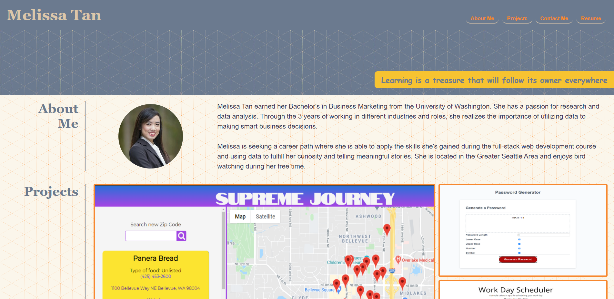

# Personal Portfolio
This is a repository for my personal portfolio to showcase my skills and talents to potential employers. It contains samples of my work This will be used to help me in my job search process. This is the second version of my portfolio. These are the updates that I have made since the first version.
Here is the first version of my [portfolio](https://melissa-tan.github.io/portfolio-melissa-tan/)

- Added projects to the cards
- Made minor CSS adjustments
- Added font awesome icons to the contact me section

## Submission Links

Repository URL: [https://github.com/melissa-tan/portfolio-updated](https://github.com/melissa-tan/portfolio-updated)

Website URL: [https://melissa-tan.github.io/portfolio-updated/](https://melissa-tan.github.io/portfolio-updated/)

## Screenshot
The below image shows the first version of my portfolio

### Submission Requirements
- Updated portfolio
- Updated GitHub profile
- Updated Resume
- Updated Linkedin